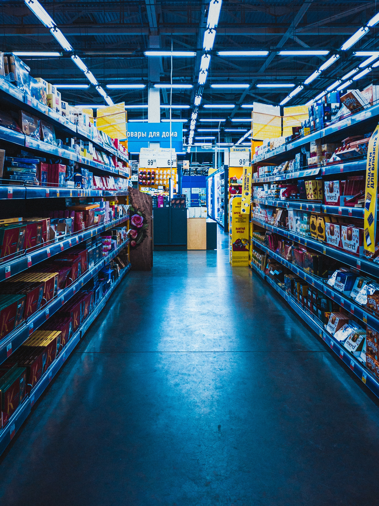

# Retail Store Analysis

## Introduction
In this analysis I investigated a hypothetical 'XYZ' retail store. The report and dashboard produced from this analysis was submitted  and presented by me at the Data Analytics and Modeling conference 2023 hosted by DBrownConsulting in Lagos, Nigeria, where my team (conprising myself and two others) won the Datathon competition.

## Problem Statement
The aim of this project is to show my strength in data preparation, modeling, visualization, insights, pattern finding, storytelling and recommendations. This analysis was done for a hypothetical 'XYZ' retail store to 